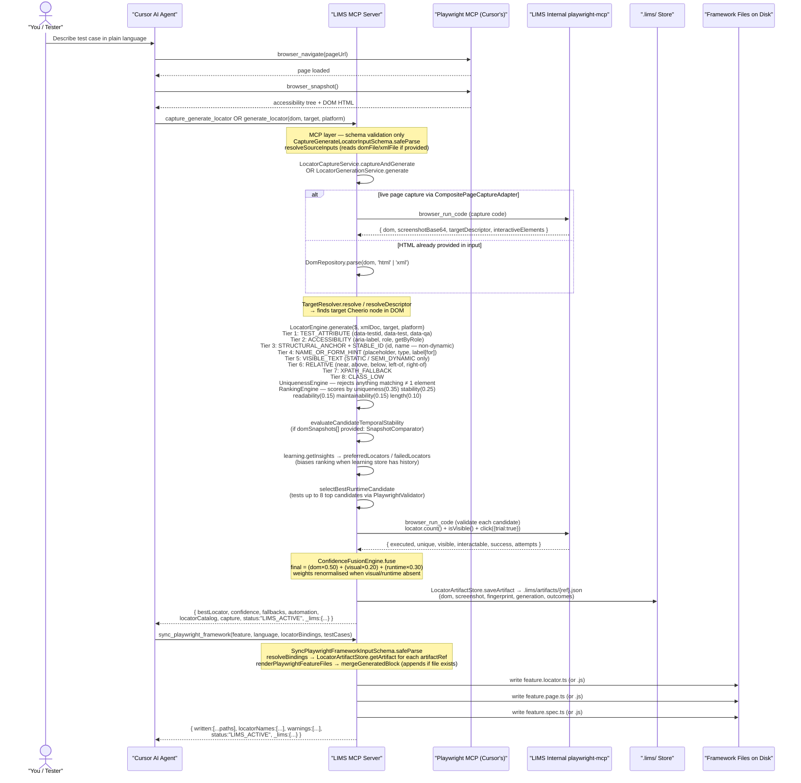
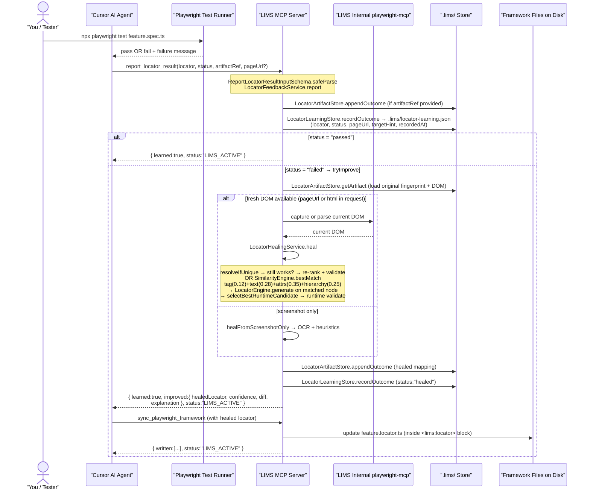
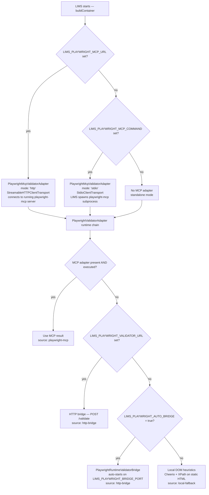
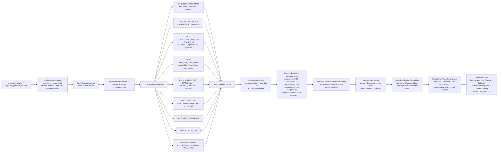
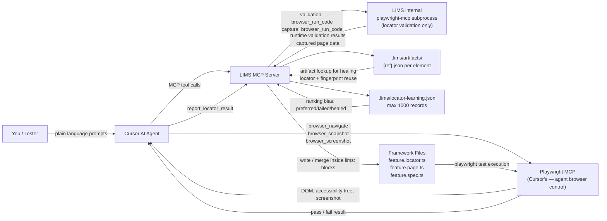

# Workflow Diagrams

All diagrams reflect the **current codebase** exactly — function names, call order, file paths, and response shapes match what is implemented.

---

## Part 1 — Capture, Generate, and Write Framework Files



---

## Part 2 — Test Run, Feedback, and Self-Healing



---

## Part 3 — Playwright MCP Connection Modes (inside LIMS)



---

## Part 4 — Internal Locator Generation Pipeline



---

## Part 5 — Component Responsibilities



---

## Exact Tool → Function Map

| MCP Tool | Schema | Service | Key internal calls |
|---|---|---|---|
| `generate_locator` | `GenerateLocatorInputSchema` | `LocatorGenerationService.generate` | `resolveSourceInputs` → `dom.parse` → `TargetResolver.resolve` → `LocatorEngine.generate` → temporal eval → learning insights → `selectBestRuntimeCandidate` → `ConfidenceFusionEngine.fuse` |
| `capture_generate_locator` | `CaptureGenerateLocatorInputSchema` | `LocatorCaptureService.captureAndGenerate` | `CompositePageCaptureAdapter.capture` → `LocatorGenerationService.generate` → `LocatorArtifactStore.saveArtifact` |
| `heal_locator` | `HealLocatorInputSchema` | `LocatorHealingService.heal` | `dom.parse` → `resolveIfUnique` OR `SimilarityEngine.bestMatch` → `LocatorEngine.generate` → `selectBestRuntimeCandidate` → `ConfidenceFusionEngine.fuse` |
| `report_locator_result` | `ReportLocatorResultInputSchema` | `LocatorFeedbackService.report` | `resolveSource` → `appendOutcome` → `learning.recordOutcome` → on fail: `healing.heal` or `generation.generate` → `appendOutcome` + `recordOutcome` |
| `sync_playwright_framework` | `SyncPlaywrightFrameworkInputSchema` | `PlaywrightFrameworkSyncService.sync` | `resolveBindings` → `artifactStore.getArtifact` → `renderPlaywrightFeatureFiles` → `mergeGeneratedBlock` → `files.write` ×3 |
| `analyze_dom` | `AnalyzeDomInputSchema` | `LocatorAnalysisService.analyze` | `dom.parse` → `FrameworkDetector.detect` → `AttributeStabilityAnalyzer` → `CanvasElementDetector` → trading hints |
| `health_check` | _(no input)_ | `HealthCheckService.check` | `checkCommandAvailable('tesseract')` → `checkPlaywrightPackageInstalled` → `runtimeValidator.validate` (synthetic DOM) → `detectRuntimeMode` from notes |

---

## Every Response Includes `LIMS_ACTIVE` Marker

Every successful response from any LIMS tool is wrapped with `withLimsMarker` in `register-tools.ts`:

```
{
  ...toolOutput,
  "status": "LIMS_ACTIVE",
  "_lims": {
    "provider": "LIMS MCP",
    "inUse": true,
    "tool": "<tool name>",
    "message": "Currently LIMS MCP is in use. Response generated by LIMS for tool \"<tool>\"."
  }
}
```

Error responses use `{ isError: true }` on the MCP content block and include a `DomainError` code and message.

---

## Files Written by `sync_playwright_framework`

Three files are always written (or merged if they already exist):

```
{outputDir}/{locatorDir ?? '.'}/{featureBase}.locator.{ts|js}
{outputDir}/{pageDir    ?? '.'}/{featureBase}.page.{ts|js}
{outputDir}/{specDir    ?? '.'}/{featureBase}.spec.{ts|js}
```

Each file uses **`<lims:locator>`**, **`<lims:page>`**, **`<lims:spec>`** marker blocks. `mergeGeneratedBlock` replaces the block if markers exist; otherwise appends. Custom code outside the markers is preserved.

**`language`** is inferred from the spec file extension if the file already exists, or from `params.language`, defaulting to `'ts'`.

---

## Similarity Scoring Used in Healing

When `resolveIfUnique` fails (old locator no longer unique), `SimilarityEngine.bestMatch` scans the DOM:

```
Element score = (tag match × 0.12) + (text match × 0.28) + (attribute overlap × 0.35) + (hierarchy similarity × 0.25)
                ─────────────────────────────────────────────────────────────────────────────────────────────────────
                          sum of weights for each axis (renormalised per pair)

text:      exact match = full weight; partial (contains) = ×0.65
attrs:     per-key comparison; near-match via Levenshtein (>0.82 similarity) = ×0.75 of that key's share
hierarchy: fraction of matching parent-tag sequence up to depth traversed
```

---

## Scope Note

This diagram reflects the current implemented path:

- **Playwright web** — full end-to-end: capture, generate, validate, heal, sync, feedback
- **Android / iOS** — snapshot-based generation and healing (XML input); no live device capture
- **Selenium** — CSS/XPath compatible output; no live Selenium validation adapter
